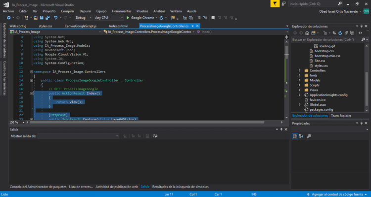
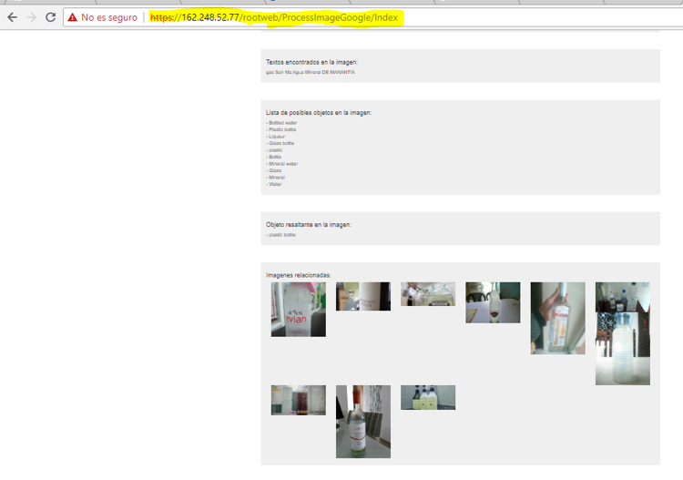
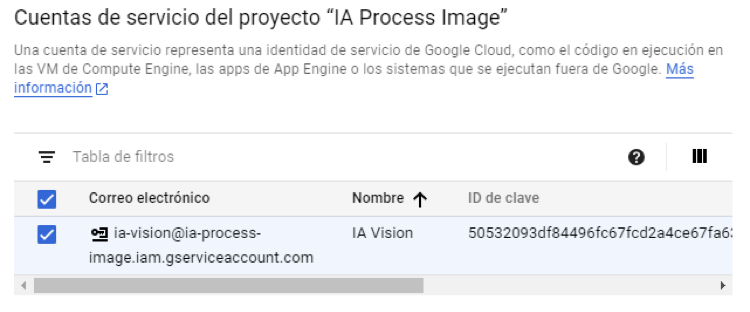
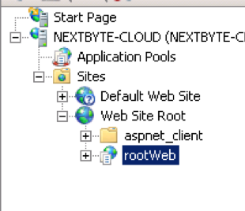
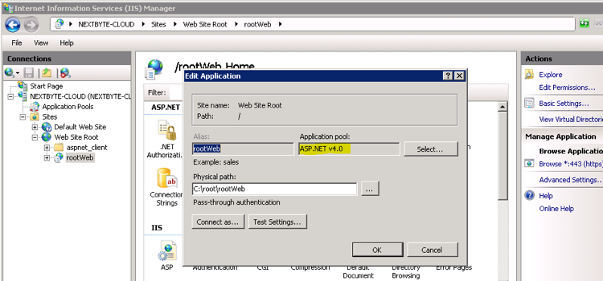

IA Process Image - Reconocimiento de Numeros por medio de Imagenes
==================================================================

Instalación del aplicativo
----------------------------

Existen dos formas de compilar y visualizar el proyecto:

De forma local:
---------------
Para pode visualizar el proyecto se necesita tener la IDE del visual stdio a partir de la versión 2017. Abrir la solución atreves de la carpeta "IA_Process_Image" que se encuentra en el repositorio del entregable y ejecutar:



Realizar la compilación:
 
Visualizar proyecto en un puerto autoasignado, 



Consideraciones:
Generar una KEY para conectar con Google Visión, para ello se pude recurrir al siguiente enlace para obtener información detallada:

https://cloud.google.com/solutions/securing-gcp-account-security-keys

Configurar las claves correctamente: 



Asegurar que existe una key que si te permita encontrar la direccion del JSON de seguridad en el web config (IA_Process_Image/web.config)

```console
<add key="rutaCredenciales" value="C:\Users\obedo\Desktop\IA_Process_Image\IA_Process_Image\IA_Process_Image\Auth\IA_Process_Image-50532093df84.json" />
```

De forma Publica:
-----------------

La segunda forma de instalar (Publicado) es atreves del IIS, configurar un aplicativo y asegurarse que la KEY del web config (Publicado/web.config) está bien configurada. Y que el framework del ambiente de trabajo tiene que ser 4.0 porque si no se podrá compilar ninguna solución.






